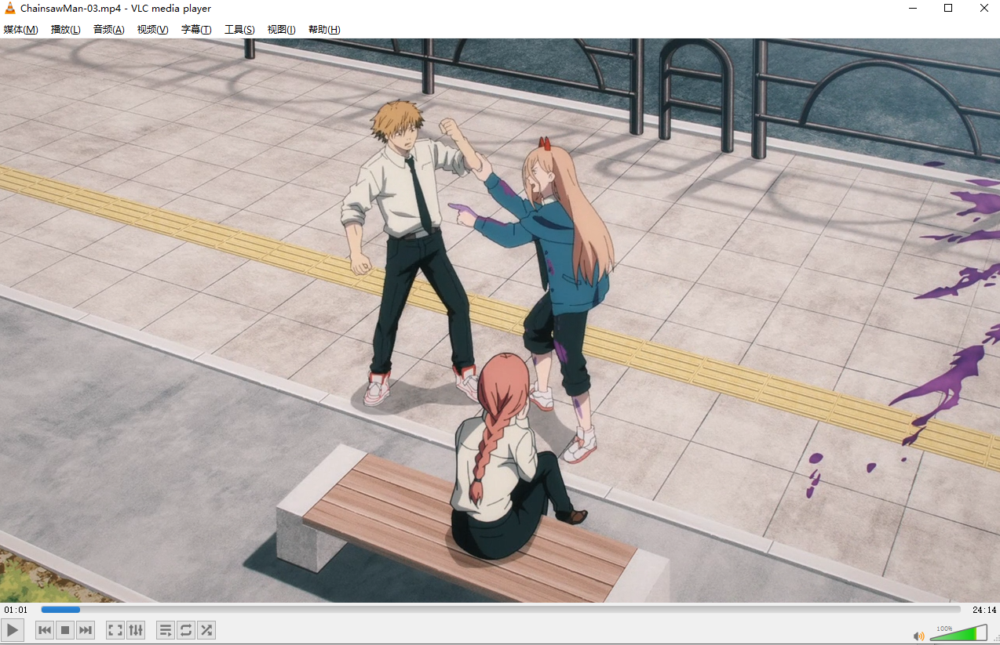
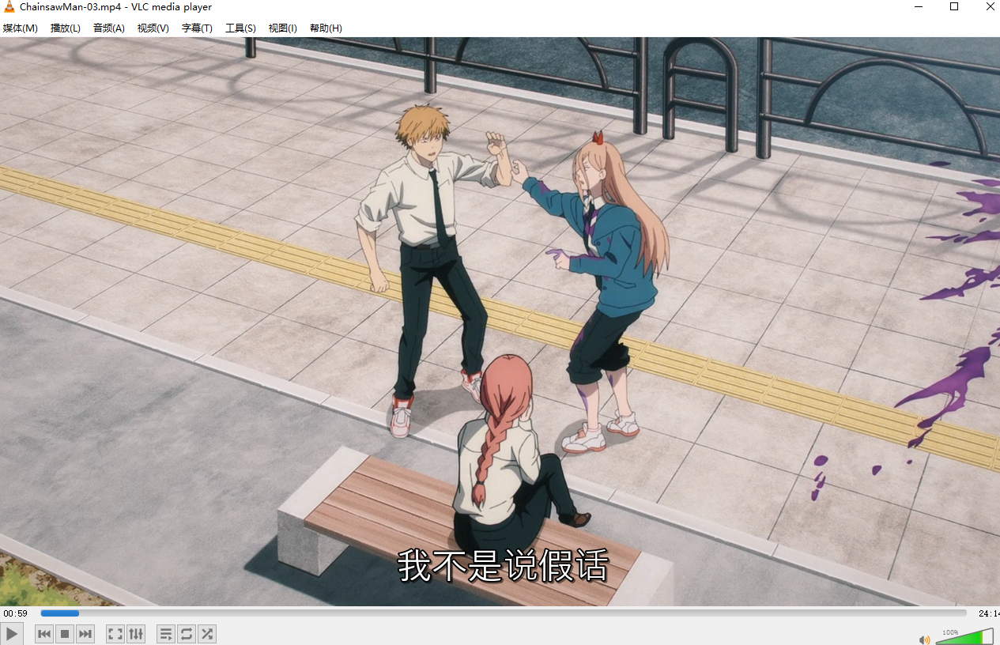

# auto_ai_subtitle

基于openai/whisper、translate、ffmpeg，自动为视频生成翻译过后的srt字幕文件，支持自定义各种语言

## 使用方法
安装 `ffmpeg`

安装依赖 `pip install -r requirements.txt`

将配置信息填入 `config.ini`

执行 `python main.py`

## 效果
原视频：

执行脚本后生成以下文件：

为视频选择要添加的字幕文件：

